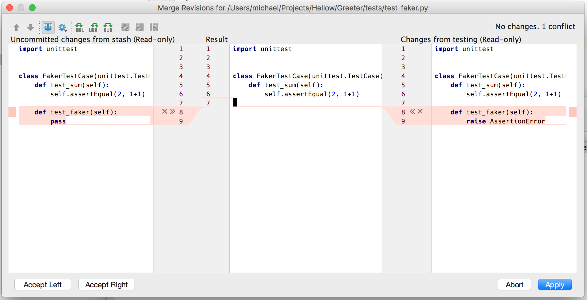

<!-- class: impact -->

# Git - première partie

## Des dépôts de code à partager

---

# Comment gérer du code logiciel ?

## Plusieurs difficultés :

1. **Suivre** le code avec **précision** :

   - Comme on l'a vu **chaque lettre compte** : une erreur = un bug qui peut être grave et nous faire perdre plusieurs heures
   - **Mémoire** : comment savoir ou l'on en était quand on **revient sur le projet d'il y a deux mois**

1. **Collaboration** : Si on travaille à 15 sur un même programme :
   - Comment **partager** nos modifications ?
   - Comment faire si deux personnes travaillent sur le même fichier => **conflits**

---

# Comment gérer du code logiciel ?

3. **Version** du logiciel :
   - Le développement est un travail **itératif** = contruction petit à petit => pleins de versions !
   - On veut ajouter une nouvelle fonctionnalité à un logiciel, mais continuer à distribuer l'ancienne version et l'améliorer.
   - On veut créer une version de test pour que des utilisateur·trices avancé·es trouvent des bugs

---

# Solution : un gestionnaire de versions

## 1. Suit **chaque modification** faite à des **fichiers**, en général des **fichiers texte** (souvent de code mais peut être autre chose : de la documentation, par exemple en format Markdown, plus rarement d'autres fichiers, comme des documents Word).

---

# Solution : un gestionnaire de versions

## 2. Permet de **stocker plusieurs versions** des **mêmes fichiers** et passer d'une version à l'autre.

Un peu comme la fonctionnalité "Historique" de Google Docs ou de Framapad en **beaucoup plus avancé**.

---

# Solution : un gestionnaire de versions

## 3. Permet suivre **qui** a fait quelle modification, **partager les modifications** avec les autres, **régler les conflits d'édition**

---

# Git !

**git** est un petit programme en ligne de commande. Qui fait tout ce dont on vient de parler :

- Suit les fichiers
- Gère les modifications successives et leurs auteurs/autrices
- Fait cohabiter plusieurs versions
- Aide à résoudre les conflits de code

---

# Écosystème git :

⚠️ **_A ne pas confondre !!!_**

- le programme **git** : le gestionnaire de version = le coeur de l'écosystème => en ligne de commande
- **les interfaces graphique de git** : VSCode et ses extensions, `tig`, `meld`, GitKraken, etc.
  - Pour faciliter l'utilisation de git et visualiser plus facilement
  - communique avec **git** sans le remplacer (ne fait que traduire vos clics de souris en commandes Git)
- **les forges logicielles** basées sur Git comme **github** ou **framagit**:
  - des plateformes web pour accéder au dépôt de code (dossier) / mettre son code sur les internets.
  - faciliter la collaboration sur un projet
  - tester et déployer le code automatiquement comme dans la démarche DevOps (plus avancé)

On va utiliser **les trois** car c'est nécessaires pour bien comprendre comment on travaille avec git sur un projet.

---

# On va utiliser

- **git** en ligne de commande souvent : il faut **absolument connaître** les fonctions de base pour travailler sur un projet de code aujourd'hui
- **VSCode** : un éditeur de texte qui a des fonctions pratiques pour visualiser les modifications git et l'historique d'un projet, afficher les conflits d'édition.
- **Gitlab** sur l'instance `gitlab.com` : une forge logicielle open-source. On va l'utiliser pour collaborer sur du code existant.

---

<!-- class: impact -->

# Git, fonctionnement de base

<!-- --- -->

**_Warning: git est à la fois simple et compliqué._**

## Mémoriser les commandes prend du temps :

### Utilisez votre _memento_ !

- On va utiliser les commandes de base durant les prochains jours pour se familiariser avec le **fonctionnement normal**.

- En entreprise on utilise tout le temps git avec une routine simple. On y reviendra.

- Même les ingénieur·es avec de l'expérience se trompent dans le comportement d'une commande Git et ne connaissent pas forcément les fonctions avancées.

---

# 1. Créer un nouveau dépôt git, valider une première version du code

Vous êtes dans un dossier avec du code :

- `git init` crée un dépôt dans ce dossier (transforme un dossier simple en un dossier avec git d'initialisé)
- `git add` permet de suivre certains fichiers (dire à git qu'il faut inclure la version actuelle de ce fichier dans git)
- `git commit` permet de **valider vos modifications** pour créer ce qu'on appelle un **commit**, c'est-à-dire une **étape validée du code**.
- `git status` et `git log` permettent de suivre l'état du dépôt et la liste des commits.

---

# Le **commit**

## **to commit** signifier **s'engager**

- **Idéalement**, lorsque vous faites un commit, le code devrait être dans un état à peu près **cohérent** et le commit devrait rassembler des **modifications qui ont du sens** pour atteindre un objectif (par exemple : résoudre un bug, rajouter une fonctionnalité, modifier de la documentation...)

## Toujours mettre un **message** de commit

- Les commits sont des étapes du développement du logiciel. Lire la liste de ces étapes devrait permettre à un·e developpeur / développeuse de comprendre l'évolution du code.

---

# Créer un nouveau dépot : Démonstration !

---

## Cycle des fichiers

- `git rm fichier` pour désindexer.
- _Tracked_ = suivi
- _Staged_ = inclus (dans le prochain commit)

---

<!-- class: impact -->

# Premier TP

---
